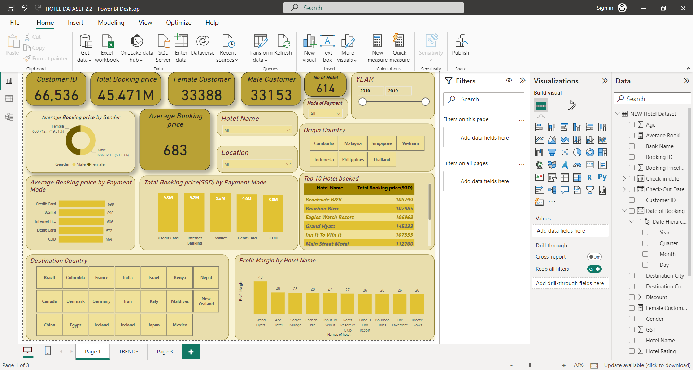
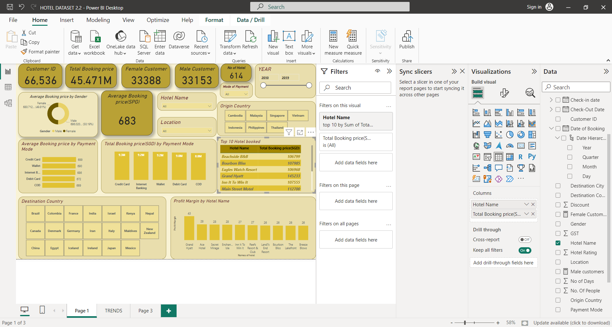
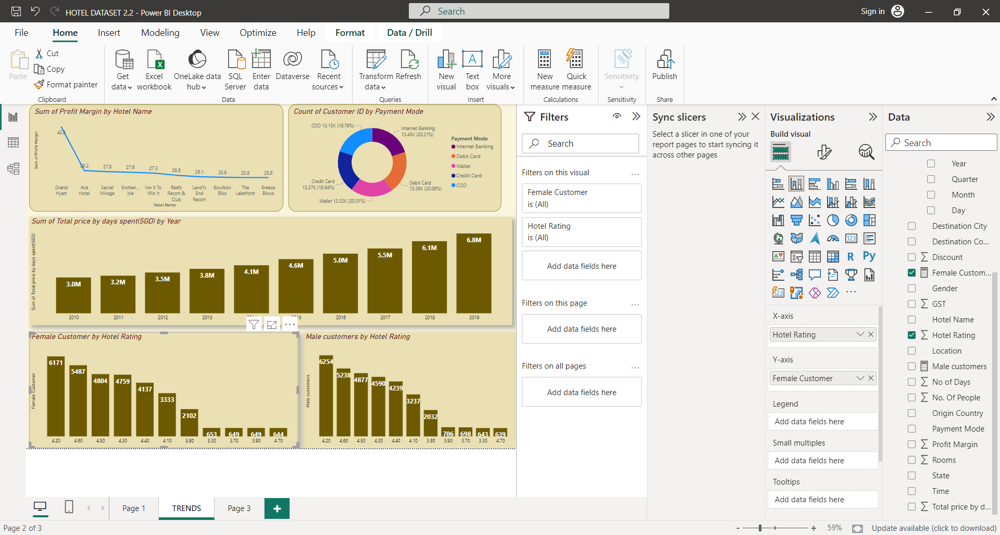

# POWER-BI-PROJECT-HOTEL-DATASET

# Introduction
This is a Power BI project to enhance/track customer preferences and behaviour (i.e hotel name, hotel preference, total booking price...) within a certain period (2010 - 2019). **The link to the dataset is embedded** [https://datafrik.co/#/datasets]

The aim of the project is to analyze the dataset of hotel bookings and extract actionable insights to optimize the company's services for international travelers. The dataset consists of Hotel and their Booking information. It contains 24 columns, 66,541 rows and the data year range is from January 2010 to December 2019 showing information about 614 hotels.

**Disclaimer: All datasets and reports do not represent any company, institution or country, but just a dummy dataset to demonstrate capabilities of Power Bi.**
SPG represents the currency

# Problem Statement
- average booking price
- total booking price
- average booking price based on gender
- top 10 most booked hotel
- variance by highest rating based on gender
- most expensive hotel
- bookings by gender
- number of days spent per year
- total number of days used per year based on each country of origin
- profit margin based on top 10
- country of origin bookings distribution over the year
- most used payment method

  # Skills Demonstrated
  I used Microsoft Excel and Power Bi for visualizing hotel dataset.
- Firstly, i imported the dataset into Excel to create some custom column (no of days) as this appeared to be an empty coumn in in the dataset.
  With the use of *Datedif* function to calculate the day difference between columns ( check-in date & check-out date) by each customer.
-  The following power bi features were incorporated: DAX, Quick measure, page navigation, filters, slicers.

# Analysis
**Average and total booking price**
The average booking price is 683(spg) while the total revenue/booking price is 45.471M(spg)

**Average booking price based on gender**

**Top 10 booked hotel and most expensive hotel**
From the visualization below, GRAND HYATT Hotel is the most booked based on the total revenue generated between 2010 to 2019

**Hotel rating by Gender and Varience based on Gender**

**Booking by Gender**
There are more of Female customers than male customers

**Number of days spent per year**

**Total number of days used per year based on each country of origin**

**Profit margin based on top 10**

**Country of origin bookings distribution over the year**
It can be said that Thailand travled the most among the Country of origin

**Most used payment method**

# Insights
Peak profit was recorded in 2019 and mostly in the month of December

Grand Hyatt Hotel is the most booked which can be attributed to it been a luxurious 5-star Hotel

